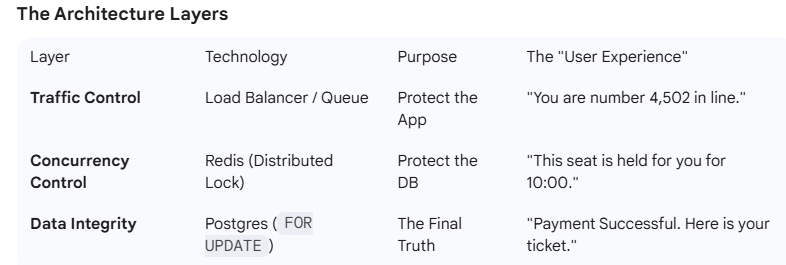

## Stuff taken directly from my conversations with chatgpt/Gemini because I'm too dumb to understand basic computer science

So we talked about the default behavior of multi version concurrency control in Postgres which is "optimistic" in nature. It's not thinking that there's going to be any contention. There are two different ways to handle this in application code (we're not going to cover the isolation levels at the db level because frankly I haven't explored them quite yet).

As we exemplified before, the default behavior has an implicit lock at the update and allows for "clean" reads making sure that there is no blocking when a resource is being read.

But for financial systems or systems that are of paramount importance -- including what we mentioned before with ticketing systems -- you CAN'T just oversell tickets or lose a deposit, right?

This is where "Pessimistic" locking comes into play. And once again i want to reiterate that mvcc is simply about visibility and not blocking, but now we're introducing specific locking mechanisms that we'll see in the application code.

Let's imagine the same scenario with the kiosk as mentioned before in part 1, but this time with pessmistic locking:

```
Imagine a giant concert stadium.

Pessimistic Locking: Person A and Person B both walk up to their own separate electronic kiosks at the exact same time. When they touch the screen, the kiosk pulls a "snapshot" of the seating map. Both screens show one seat left (Seat 1A).

The Interpretation: * Person A thinks: "Awesome, Seat 1A is free. I'll take it."

Person B thinks: "Awesome, Seat 1A is free. I'll take it."

Person A clicks on the seat, this locks the seat for updating. Underneath the hood, in Hibernate, it translates to a FOR UPDATE select statement.

A millisecond later Person B goes to click on the seat, but the kiosk just FREEZES and remains frozen until person A is finished with what they're doing. 

Eventually, person B gets a notice saying "Sorry, this seat has been taken".
```
This is only an analogy as in REAL life at ticket master or this kiosk other mechanisms would be at play -- most likely redis caching with NX, soft locking and websockets, but that will be explored later.

Here's another alternative analogy:

```
How to explain it simply:
If you’re explaining this to someone else, use the "Phone Line" analogy:

MVCC: It’s like a recorded message. Everyone can call and hear the status of the seat at the same time. The recording might be old, but the line is never busy.

Pessimistic Locking: It’s like calling a human operator. If Alice is talking to the operator about Seat 1A, when Bob calls, he gets a busy signal (or stays on hold). He can't even get information about the seat until Alice hangs up.
```

Let's look at this implemented in a simple Java Spring Boot snippet. At the repository level:

```
public interface TicketRepository extends JpaRepository<Ticket, Long> {

    @Lock(LockModeType.PESSIMISTIC_WRITE)
    @Query("SELECT t FROM Ticket t WHERE t.id = :id")
    Optional<Ticket> findByIdWithLock(@Param("id") Long id);
}
```

And at the service level as before:
```
@Service
public class TicketService {

    @Autowired
    private TicketRepository repo;

    @Transactional
    public void purchaseTicket(Long ticketId) {
        // 1. SELECT ... FOR UPDATE
        // If another transaction has this lock, this thread HANGS here until the lock is released.
        Ticket ticket = repo.findByIdWithLock(ticketId)
            .orElseThrow(() -> new RuntimeException("Ticket not found"));

        if (ticket.getQuantity() > 0) {
            
            // 2. THE HUMAN WINDOW: 3rd party credit card call (2 seconds)
            // Alice is safe here because she holds the DB lock. 
            // Bob is stuck at step 1 on his kiosk/thread.
            paymentService.charge(user, price); 
            
            // 3. UPDATE: Decrement and save
            ticket.setQuantity(ticket.getQuantity() - 1);
            repo.save(ticket); 
        } // 4. TRANSACTION COMMITS: Lock is released here.
    }
}
```

Some notes from Gemini.

```
Important Considerations for Pessimistic Locking
Timeouts: You generally don't want Bob to wait forever. You can set a hint to tell the DB to give up after a few seconds: @QueryHints({@QueryHint(name = "javax.persistence.lock.timeout", value = "3000")})

Database Connections: Remember that while Bob is waiting, he is still holding onto a connection from your HikariCP connection pool. If you have 100 "Bobs" all waiting for one "Alice," you can quickly exhaust your pool and crash the whole app.

Deadlocks: If Alice locks Row 1 and wants Row 2, while Bob locks Row 2 and wants Row 1, they will wait for each other forever. Postgres will eventually detect this and kill one of the transactions.

This is the most "secure" way to handle high-contention data like money or inventory, provided the "Human Window" (the payment call) is relatively short.
```

In the real world since this causes so much hang, systems at scale push this waiting at a higher level. For ticketing systems, they relieve backpressure with Queue systems to let people into a presale event, and even at the sale event soft locks happen at a Redis cache level maybe partitioned by event_id and seat_id to ensure even distribution across the clusters to handle traffic.

