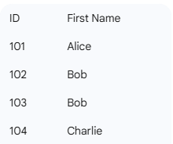

## Stuff taken directly from my conversations with chatgpt/Gemini because I'm too dumb to understand basic computer science

Pagination is the standard way of "paging" and batching listed data into sections for consumption. Imagine 1000 items in a list, we separate these by pages, and in web development the "default" pattern is using OFFSETS.

Logically we can think of offsets as "start counting AFTER the given OFFSET" so if the offset is 100, we begin counting after item 100. How this translates to code however, at least in Spring Boot -> Hibernate -> SQL, the resulting SQL becomes something like

```SELECT * FROM users LIMIT 10 OFFSET 100```

The two biggest cons to this strategy are:
- What happens if a new piece of data is inserted in that first 100?
- The SQL above has to fetch 110 rows and then throws away the first 100! As the user goes deeper in pages, it gets worse and worse

This quickly became unscalable with the advent of the "infinite scroll" in the early aughts. Developers at Twitter and Slack were some of the first companies to propose something different in application code.

Let's consider HOW you would solve this problem in raw SQL, assuming we have an ORDERED list, you could say something like "Hey give me all the items after item 20" right? You'd need _some_ sort of sort key though to intend that you know what to search. 

```SELECT * FROM users WHERE user_id > 20"```

https://slack.engineering/evolving-api-pagination-at-slack/

(The above is an example in which sequential ids are used for user_ids)

Talking to gemini, my brain is too slow to even imagine writing this pseudo code:

```
// How they hand-rolled the 'Tie-Breaker' logic
public String generateCursor(Product p) {
    // Combine the sort field (Price) and the Unique ID
    String raw = "price:" + p.getPrice() + "|id:" + p.getId();
    return Base64.encode(raw);
}

public Query buildQuery(String encodedCursor) {
    Cursor c = decode(encodedCursor);
    // The "Greater Than" logic you mentioned!
    return "SELECT * FROM products " +
           "WHERE (price > :p) OR (price = :p AND id > :id) " +
           "ORDER BY price ASC, id ASC LIMIT 20";
}
```

Note that to make this sorting deterministic it's often best to have more than one column as part of the query:



```
If your cursor is just last_seen_name = 'Bob', and you ask the database for WHERE first_name > 'Bob' LIMIT 1, the database skips both Bobs and goes straight to Charlie. You just missed the second Bob (ID 103) entirely!

By adding the ID as the "tie-breaker," your cursor becomes a tuple: ('Bob', 102).

Now the logic is: "Give me the next person who has a name 'greater' than Bob OR whose name is Bob but their ID is greater than 102."
```

This might look familiar in indexing, it's a composite index made up of two columns.